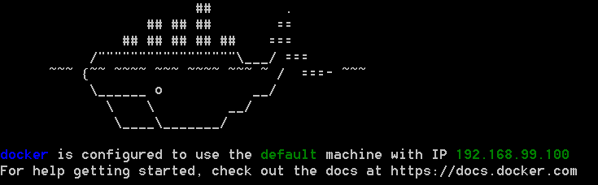
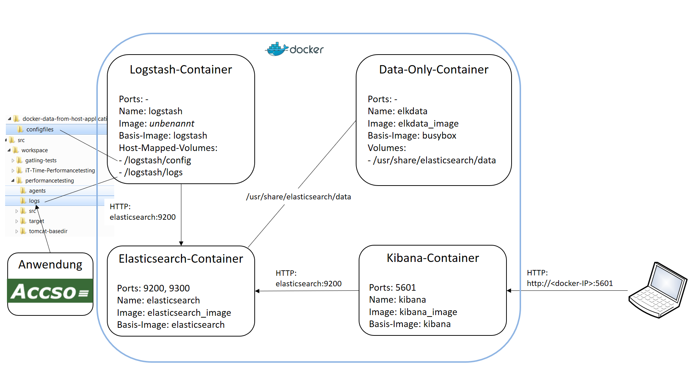
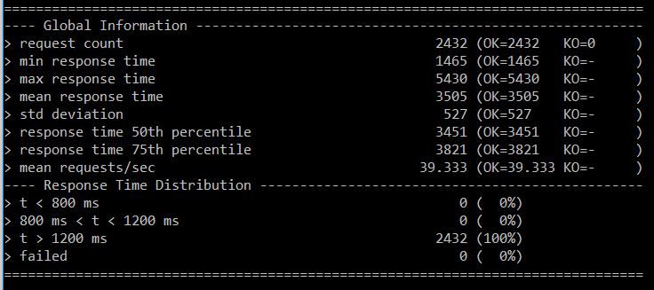
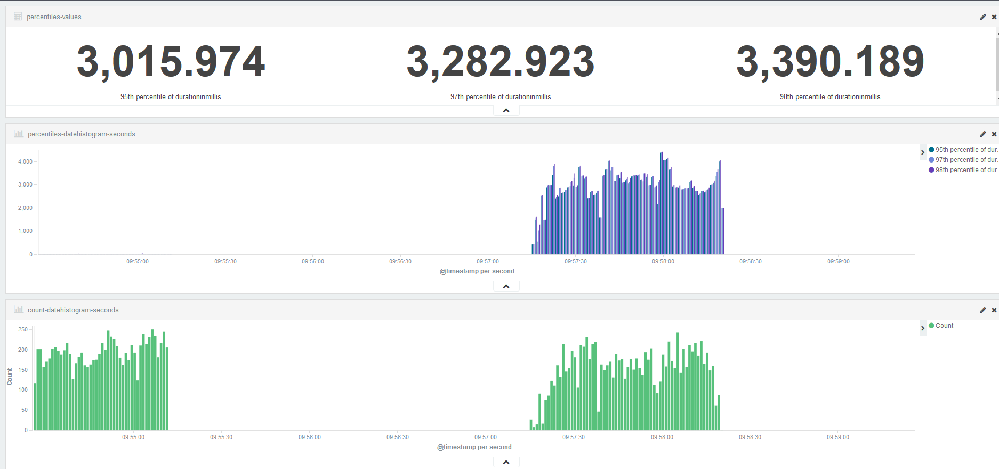
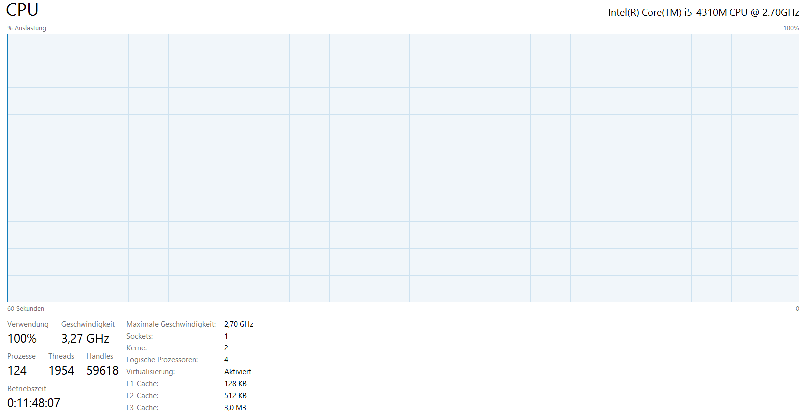
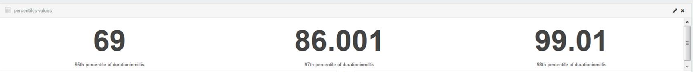

# README

## Einleitung

Die Demo-Anwendung zur Kundenverwaltung ist das System unter Test für die hier im Vordergrund stehenden zwei Gatling-Testszenarien _TestCreateCustomer_ zum Anlegen von Kunden mit ihren Produktfavoriten und _TestReadCustomers_ zum zufälligen Abrufen von Kundendaten.

Insbesondere _TestReadCustomers_ realisiert ein Lasttestszenario, das die Demo-Anwendung ungesteuert mit maximaler Aufrufrate in den Überlastbereich bringt, um so die Grenzen der Software und Hardware auszuloten. Demgegenüber würden Performancetests ein vordefiniertes Belastungsmuster prüfen.

## Voraussetzungen

* **Docker-Installation**
Die beschriebenen Performance-Installation wurde unter Windows 7 und Windows 10 mit Docker 1.11.2 (Docker Toolbox) erstellt.
* **Java Runtime**
Die instrumentierte Demo-Anwendung wurde mit Java 8 (1.8.0._92) getestet.
* **Maven**
Die Demo-Anwendung wurde mit Maven 3.3.9 gebaut.
* **Demo-Anwendung**
Die Quellen der Demo-Anwendung src im beliebigen Verzeichnis DEMOROOT.
* **Docker-Konfigurationsdateien**
Die Konfigurationen für die Docker-Infrastruktur `docker-data-from-host-application` der Demo-Anwendung im Verzeichnis DEMOROOT.
* Eine Breitband-Internetanbindung zum Herunterladen der benötigten Maven-Artefakte und Docker-Images (ca. 2GB).

## Überblick

Mit Hilfe von Docker entstehen einzelne Container, in denen die benötigten Anwendungen Logstash 2.3.2, Elasticsearch 2.3.0 und Kibana 4.5.1 laufen. Die Anwendungen laufen in ihren Containern unter ihren Standard-Ports und sind von außerhalb unter der IP-Adresse erreichbar, die Docker beim Start ausgibt, bspw. 192.168.99.100:

Die Demo-Anwendung läuft neben den Docker-Containern auf dem Host:

* Die Demo-Anwendung produziert die Logdaten außerhalb von Docker auf dem Host.
* Der Logstash-Container mappt seine Daten vom Host.
* Der Data-Only-Container hält Daten auch bei Beendigung der anderen Docker-Prozesse.

## Schritt-für-Schritt-Vorgehen

* Start der Docker-bash und Navigation ins Verzeichnis `docker-data-from-host-application` 
* ELK-Stack starten durch Eingabe von `docker-compose up –d`
    * Docker lädt die Images busybox, elasticsearch, logstash und kibana.
    * Docker erzeugt die Images elkdata_image, elasticsearch_image und kibana_image.
    * Docker fährt die ELK-Anwendungen als Services elkdata, logstash, elasticsearch und kibana in jeweils eigenen Containern hoch.
    * Ergebnis: 
logstash wartet auf die Logausgaben im Host-logs-Verzeichnis `src/workspace/performancetesting/logs` (im Container gemappt auf `/logstash/logs`).
* Überprüfung der laufenden Installation
    * Elasticsearch-Aufruf im Browser mit der Adresse: http://<docker-ip\>:9200/_plugin/hq.
    * Ergebnis: Es sollte das Elasticsearch-Dashboard zu sehen sein. Das mitinstallierte ElasticHQ-Plugin erzeugt dieses Dashboard. 
* Starten der Demo-Anwendung
    * In einer Shell Navigation ins Verzeichnis `src/workspace/performancetesting`.
    * Aufruf von `mvn spring-boot:run` 
* Starten der Lasttests, zunächst Schreibzugriffe, dann Lesezugriffe
    * In einer Shell Navigation ins Verzeichnis `src/workspace/performancetesting`. 
    * Aufruf von `mvn gatling:execute -Dgat-ling.simulationClass=de.accso.performancetesting.TestCreateCustomer`
    * Aufruf von `mvn gatling:execute -Dgat-ling.simulationClass=de.accso.performancetesting.TestReadCustomers`
* Zwischenstand:
    * Die Anwendung schreibt in die in `src/workspace/performancetesting/src/main/resources/logback.xml` konfigurierte Log-Datei (`src/workspace/performancetesting/logs/performance.log`).
    * Logstash überträgt die Daten in Elasticsearch.
    * Im Elasticsearch-Dashboard sollte der Logstash-Index logstash-\<Tagesdatum\> (Bsp.: logstash-2016.03.12) zu sehen sein, dessen Dokumentanzahl zunimmt.
* Kibana-Auswertung durchführen
    * Kibana im Browser mit der Adresse http://<docker-ip\>:5601 aufrufen
    * Beim ersten Aufruf den Default-Index erzeugen (bietet Kibana direkt an): die Standardeinstellungen (logstash-* mit @timestamp) verwenden
    * Anschließend steht Kibana für eigene Auswertungen zur Verfügung.
    * Einsatz des vorkonfigurierten Dashboard: 
        * Kibana-Menü Settings->Objects->Import aufrufen
        * Die Konfigurationsdatei `docker-data-from-host-application/configfiles/applicationdata-kibana-configuration.json` laden
* Ergebnis:
Das Dashboard “performanceapplication-dashboard” zeigt die Daten der letzten 5 Minuten in den vorkonfigurierten Ansichten (durch Festlegen der global konfigurierten Zeitspanne).
    * Fallstrick 1: 	
Deckt die konfigurierte Zeitspanne nicht die Zeitangaben der geladenen Daten ab, dann zeigt Kibana statt der Daten die Meldung „No results found“ an. In diesem Fall zuerst die globale Zeitfestlegung in Kibana mit den in Elasticsearch geladenen Daten abgleichen!
    * Fallstrick 2: 	
Bietet der Bildschirm nicht ausreichend Platz zur Darstellung der geladenen Daten (z.B. weil das X-Achsen-Intervall sehr feingranular auf Sekunden eingestellt ist), dann zeigt Kibana „This container is too small to render the visualization“. In diesem Fall reicht es aus, den Betrachtungszeitraum zu verkleinern.

Gatling selbst hält übrigens gut aufbereitete Reports bereit. Einen ersten Überblick bekommt man in der Shell, hier am Beispiel des Kundendaten-Abrufszenarios:

Detailliert aufbereitete HTML-Graphiken stehen im Target-Verzeichnis unter `src/workspace/performancetesting/target/gatling` bereit.

Für kontinuierliche oder explorative Auswertungen bleibt hier aber ELK das Mittel der Wahl.

## Ergebnisinterpretation

Auf einem Entwicklernotebook wird der Lasttest mit der einfachen Demo-Anwendung vordergründig erstaunliche Ergebnisse ähnlich dem folgenden produzieren:

Die Anwendung ist trotz simplen Aufbaus und einer In-Memory-Datenbank mit über 3 Sekunden mittlerer Latenzzeit unglaublich inperformant. Die Aufrufanzahl (untere grüne Graphik) zeigt die durch die beiden Testszenarien erzeugten Phasen. 

Beobachtung und Vermutung:

* Während das Kundenanlegen kaum ins Gewicht fällt, führt das Kundenlesen schnell zu hohen Antwortzeiten und bestimmt maßgeblich die Quantilwerte.
* Der steile Anstieg der zweiten Phase zeigt deutlich den Test-RampUp auf bis zu 20 parallele Nutzer.
* Da das Notebook während des Tests zu 100% ausgelastet war, handelt es sich offensichtlich um einen CPU-Engpass.	

Grundsätzlich könnte der Engpass auch die Folge des stark vereinfachten Testaufbaus sein, in dem sowohl die Docker-Container als auch die Anwendung, als auch der Testtreiber um die Betriebsmittel konkurrieren. 

Ein Vergleich mit der Anwendung auf einer 32-Kern-CPU-Maschine bestätigt allerdings die Vermutung, dass der Testlauf auf dem Entwicklernotebook keine gute Idee war:

